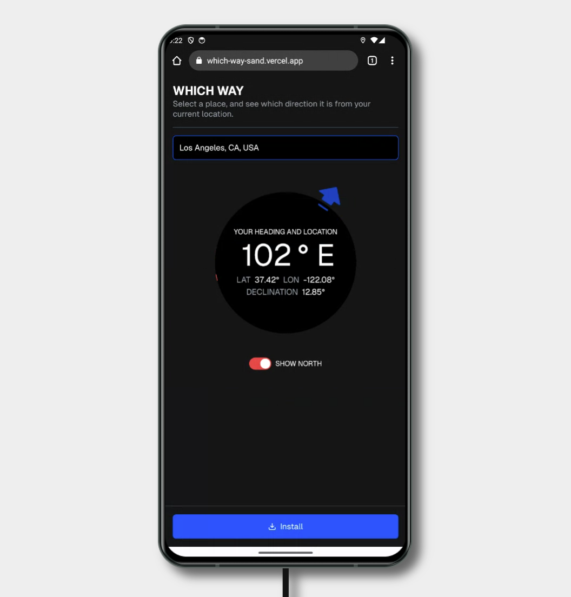

## Which Way

Select a location, and see which direction it is from your current location.



## Getting started

1. Run `pnpm i` followed by `pnpm dev` to install the dependencies and start the development server.
2. Add your API keys to the `.env` file.

- `NEXT_PUBLIC_GOOGLE_MAPS_API_KEY`: The Google Maps API is used on the Google Places Autocomplete component.

3. Navigate to [http://localhost:3000](http://localhost:3000).

### Setting Up a Development SSL Certificate for Local testing

To enable features that require HTTPS, such as device orientation, you can set up a local SSL certificate using `mkcert` and then access your development site securely on both your PC and mobile device.

#### Step 1: Install `mkcert`

First, install `mkcert`, which simplifies creating local SSL certificates trusted by your system.

- **Using Chocolatey (Recommended)**

  ```bash
  choco install mkcert
  ```

- **Or using Scoop**
  ```bash
  scoop install mkcert
  ```

If you don't have Chocolatey installed, you can install it by running the following command in PowerShell as Administrator:

```powershell
Set-ExecutionPolicy Bypass -Scope Process -Force; [System.Net.ServicePointManager]::SecurityProtocol = [System.Net.ServicePointManager]::SecurityProtocol -bor 3072; iex ((New-Object System.Net.WebClient).DownloadString('https://community.chocolatey.org/install.ps1'))
```

#### Step 2: Create the SSL Certificate

After installing `mkcert`, run the following commands to set up a local certificate for `localhost`:

```bash
# Install the local CA in the system trust store
mkcert -install

# Create certificate for localhost in your project directory
cd your-project-directory
mkcert localhost
```

This will create two files in your current directory:

- `localhost.pem` (the certificate)
- `localhost-key.pem` (the private key)

#### Step 3: Move the Certificate Files

If you did not run the command in your project root, move the certificate files there:

```powershell
# Adjust paths as needed
Move-Item localhost.pem your-project-directory
Move-Item localhost-key.pem your-project-directory
```

#### Step 4: Update Next.js Configuration for HTTPS

Update the `dev` script in `package.json` to enable HTTPS in development:

```json
{
  "scripts": {
    "dev": "next dev --experimental-https"
  }
}
```

#### Step 5: Access Your Localhost Site on a Mobile Device

To access your development site on a mobile device, ensure that your computer and phone are on the same Wi-Fi network.

1. **Get Your Computer's Local IP Address**: Open a terminal and type `ipconfig` (Windows) or `ifconfig` (Mac/Linux) to find your local IP address (e.g., `192.168.1.100`).
2. **Access the Site on Your Phone**: Open Safari or another browser on your mobile device and navigate to `https://192.168.1.100:3000`.

   - **Note**: You may need to trust the certificate manually on your mobile device:
     - On iOS, go to **Settings > General > About > Certificate Trust Settings** and enable full trust for your local certificate.

#### Important Notes

- **Device Orientation and HTTPS**: Some features, like `DeviceMotionEvent` and `DeviceOrientationEvent`, require HTTPS to function on iOS. If you don't serve your site over HTTPS, these events will not work, even in development.
- **Ensure Motion & Orientation Access is Enabled**: On iOS, go to **Settings > Safari > Motion & Orientation Access** and ensure it is enabled.
